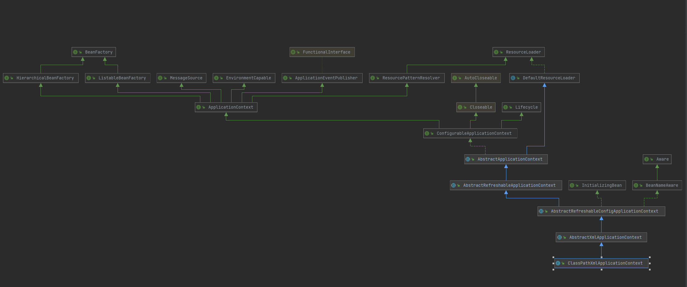

# 容器初始化流程

## 示例

```java
//解析demo1.xml配置，刷新容器(启动时初始化容器)
BeanFactory beanFactory=new ClassPathXmlApplicationContext("demo1.xml");
//获取bean
User user=(User)beanFactory.getBean("user");
```

这段代码包含了对XML解析、容器初始化、Bean的获取

## 过程分析
### ClassPathXmlApplicationContext
- [类图](类图/ClassPathXmlApplicationContex类图.md)

- 构造方法
```java
public ClassPathXmlApplicationContext(
    String[] configLocations, boolean refresh, @Nullable ApplicationContext parent)
    throws BeansException {

    super(parent);
    //替换占位符，这里初始化了environment
    setConfigLocations(configLocations);
    if (refresh) {
        //XML解析和容器初始化
        refresh();
    }
}
```
ClassPathXmlApplicationContext构造有两种方式,
- 指定多个config location，保存为String[] configLocations，定义在AbstractRefreshableConfigApplicationContext
- 指定classpath路径和Class，保存为Resource[] configResources，定义在ClassPathXmlApplicationContext

下图为loadBeanDefinitions(AbstractXmlApplicationContext), 可以看到两种配置都加载，具体实现后面再介绍
```java
protected void loadBeanDefinitions(XmlBeanDefinitionReader reader) throws BeansException, IOException {
    //ClassPathXmlApplicationContext第二种构造方式保存的配置
    Resource[] configResources = getConfigResources();
    if (configResources != null) {
        reader.loadBeanDefinitions(configResources);
    }
    
    //ClassPathXmlApplicationContext第一种构造方式保存的配置
    String[] configLocations = getConfigLocations();
    if (configLocations != null) {
        reader.loadBeanDefinitions(configLocations);
    }
}
```
 在构造方法中执行了两个操作
> - 对参数中的占位符替换
> - 刷新容器
#### 占位符替换
//TODO

#### 刷新容器
refresh 方法,定义在ConfigurableApplicationContext接口中
```java
public void refresh() throws BeansException, IllegalStateException {
		synchronized (this.startupShutdownMonitor) {
			// Prepare this context for refreshing.
			prepareRefresh();

			// Tell the subclass to refresh the internal bean factory.
			ConfigurableListableBeanFactory beanFactory = obtainFreshBeanFactory();

			// Prepare the bean factory for use in this context.
			prepareBeanFactory(beanFactory);

			try {
				// Allows post-processing of the bean factory in context subclasses.
				postProcessBeanFactory(beanFactory);

				// Invoke factory processors registered as beans in the context.
				invokeBeanFactoryPostProcessors(beanFactory);

				// Register bean processors that intercept bean creation.
				registerBeanPostProcessors(beanFactory);

				// Initialize message source for this context.
				initMessageSource();

				// Initialize event multicaster for this context.
				initApplicationEventMulticaster();

				// Initialize other special beans in specific context subclasses.
				onRefresh();

				// Check for listener beans and register them.
				registerListeners();

				// Instantiate all remaining (non-lazy-init) singletons.
				finishBeanFactoryInitialization(beanFactory);

				// Last step: publish corresponding event.
				finishRefresh();
			}

			catch (BeansException ex) {
				if (logger.isWarnEnabled()) {
					logger.warn("Exception encountered during context initialization - " +
							"cancelling refresh attempt: " + ex);
				}

				// Destroy already created singletons to avoid dangling resources.
				destroyBeans();

				// Reset 'active' flag.
				cancelRefresh(ex);

				// Propagate exception to caller.
				throw ex;
			}

			finally {
				// Reset common introspection caches in Spring's core, since we
				// might not ever need metadata for singleton beans anymore...
				resetCommonCaches();
			}
		}
	}
```

