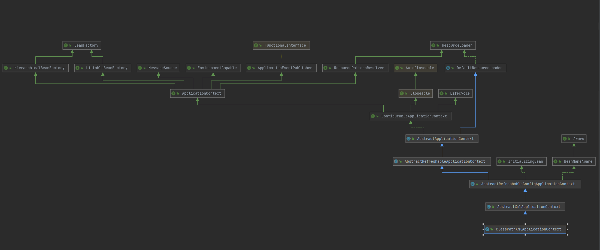

# ClassPathXmlApplicationContext

- ## 类图如下

- ## 接口介绍

    - ### [BeanFactory](../../../spring-beans/src/main/java/org/springframework/beans/factory/BeanFactory.java)
  > 定义多种getBean方法，指定了FactoryBean的前缀&, 其默认实现是[DefaultListableBeanFactory](../../../spring-beans/src/main/java/org/springframework/beans/factory/support/DefaultListableBeanFactory.java)

    - ### [ResourceLoader](../../../spring-core/src/main/java/org/springframework/core/io/ResourceLoader.java)
  > 定义getResource方法，默认实现是[DefaultResourceLoader](../../../spring-core/src/main/java/org/springframework/core/io/DefaultResourceLoader.java)

    - ### [MessageSource](../../../spring-context/src/main/java/org/springframework/context/MessageSource.java)
  > 定义getMessage方法，用于国际化
    - ### [ListableBeanFactory](../../../spring-beans/src/main/java/org/springframework/beans/factory/ListableBeanFactory.java)
  > BeanFactory的拓展，包含对BeanDefinition的操作和获取批量Bean操作
  

## 类介绍